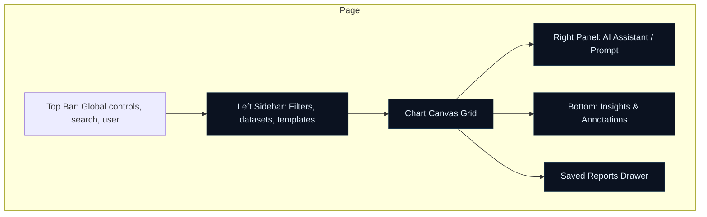

# AI Charts — Wireframes & UX Flows

This document contains professional wireframes and UX flows for the AI Charts workspace.

## Desktop layout (Mermaid)



## Tablet layout (Mermaid)

```mermaid
flowchart TB
  subgraph Tablet
    A[Top Bar]
    B[Filters as collapsible left drawer]
    C[Single-column chart canvas (stacked)]
    D[AI Assistant collapsible bottom sheet]
  end
```

## Interaction & data flow (Upload → AI Analysis → Chart Generation)

```mermaid
sequenceDiagram
  participant U as User
  participant F as Frontend
  participant B as Backend (API)
  participant Q as Job Queue
  participant AI as LLM/AI
  participant DB as Mongo

  U->>F: Upload dataset + prompt
  F->>B: POST /api/ai-charts/jobs (payload: file meta + prompt + filters)
  B->>Q: enqueue job (jobId)
  Q-->>F: return jobId
  F->>F: open SSE /jobs/:id/stream to receive progress
  Q->>B: start processing job (worker)
  B->>AI: request intent parsing & chart spec
  AI-->>B: chart spec + insights
  B->>DB: fetch transactions / enrich / cache
  B->>AI: request enhanced insights (if available)
  AI-->>B: insights text
  B->>Q: emit progress (parsed, aggregating, chart_ready)
  Q-->>F: SSE events stream progress
  Q-->>F: final chart payload (chart + insights + kpis)
  F->>U: render chart on canvas; show Insights
```

## UX Notes

- Provide prominent dataset summary card after upload (rows, columns, date range).
- AI Assistant shows suggested prompts and one-click recommended charts.
- Chart Canvas supports drag/drop widgets, resizing, and full-screen.
- Insights panel surfaces AI-generated bullets and 'Explain this chart' button.
- Saved reports accessible from the right drawer with quick-open.
- Use subtle glassmorphism, large type for KPIs, and animated transitions on state changes.
